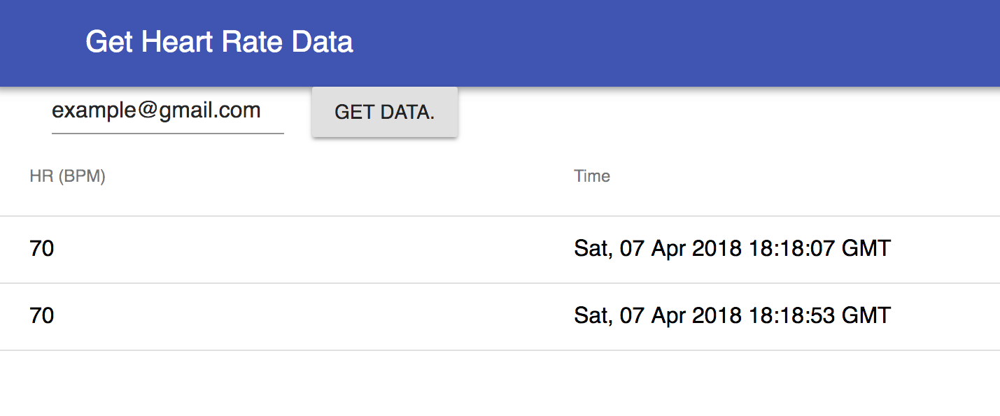

This is the frontend for a heart rate database server that returns all of the
 measured heart rates and times at which they occurred for a user. The front end
was built with React.  A screenshot of the frontend can be seen below:

To run the frontend, type cd react-learning from the project root, then type "npm run start".
